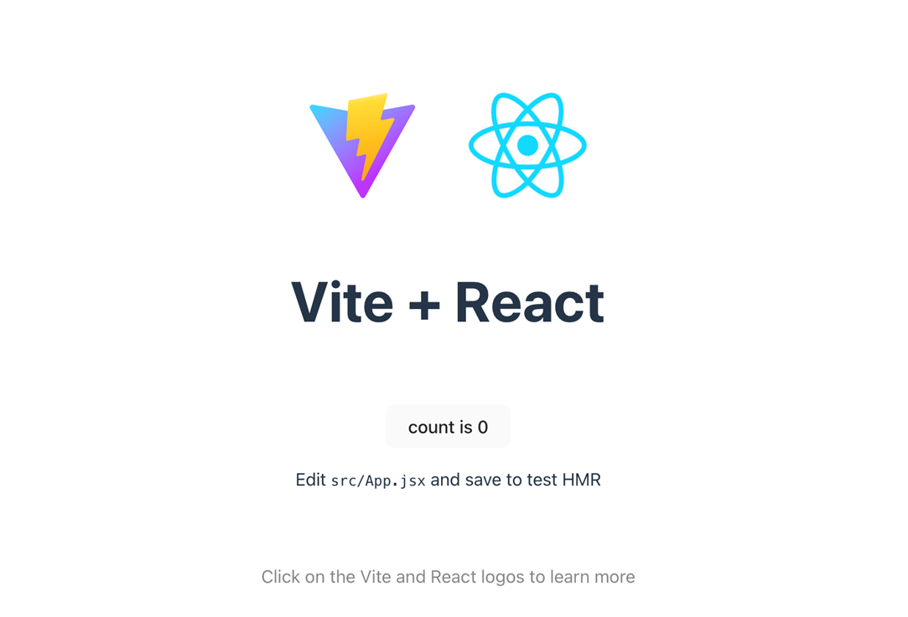

#### Instalasi React dengan Vite
by [Jihadul Akbar](https://github.com/jihadul4kbar)

---

## Vite

--

### Instalasi

Pertama
```js
npm create vite@latest
```

--

kedua
```
create-vite@6.0.1
Ok to proceed? (y) y
```

--

ketiga 
```
> npx
> create-vite
✔ Project name: … frontend // nama project 
✔ Select a framework: › React // pilih react
✔ Select a variant: › JavaScript // pilih javascript
Done. Now run:
```

--

keempat
```
  cd frontend  // masuk direktori frontend 
  npm install  // jalankan perintah npm install di dalam project
  npm run dev  // menjalankan react
```

--

kelima akan muncul perintah telah berjalan aplikasi react
```
  VITE v5.4.8  ready in 367 ms

  ➜  Local:   http://localhost:5173/
  ➜  Network: use --host to expose
  ➜  press h + enter to show help
```

--

buka browser dengan  url http://localhost:5173/
maka akan mucul halaman 

--

instalasi telah berhasil

---

### Menampilkan data dari BeckEnd

Installasi depedensi 
```js
npm install axios 
```

--

Buat file folder service di dalam folder src dan buat file api.js dan isikan kode berikut 
```js
import axios from "axios";

const API = axios.create({
    baseURL: "http://localhost:3000/api/users", // URL backend
});

export const getUsers = () => API.get("/");
export const getUser = (id) => API.get(`/${id}`);
export const createUser = (data) => API.post("/", data);
export const updateUser = (id, data) => API.put(`/${id}`, data);
export const deleteUser = (id) => API.delete(`/${id}`);
```

--

lanjut pada batian ke dua